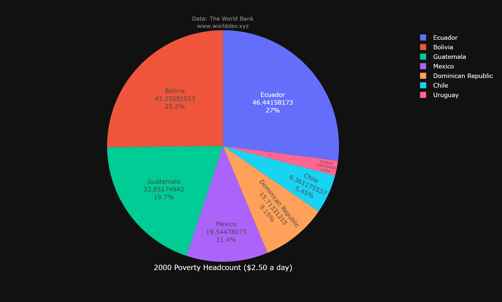
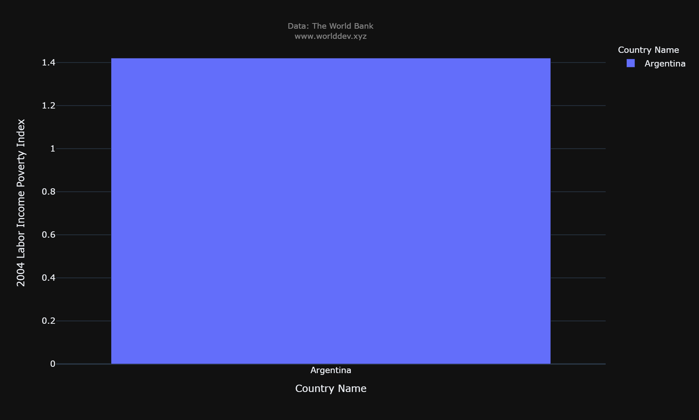
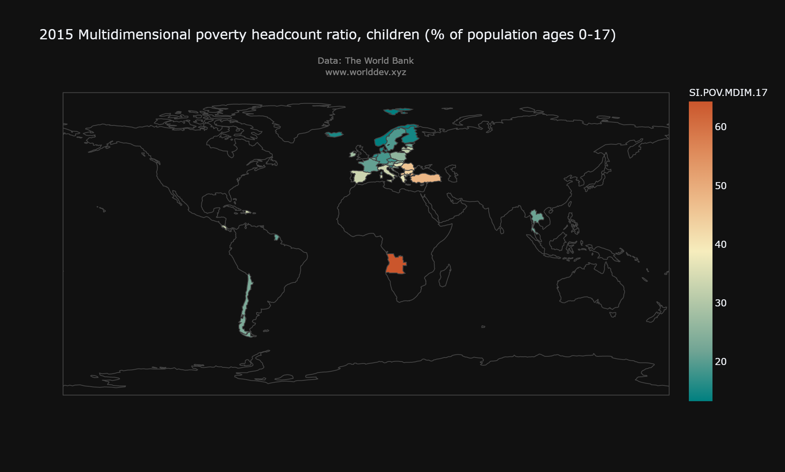
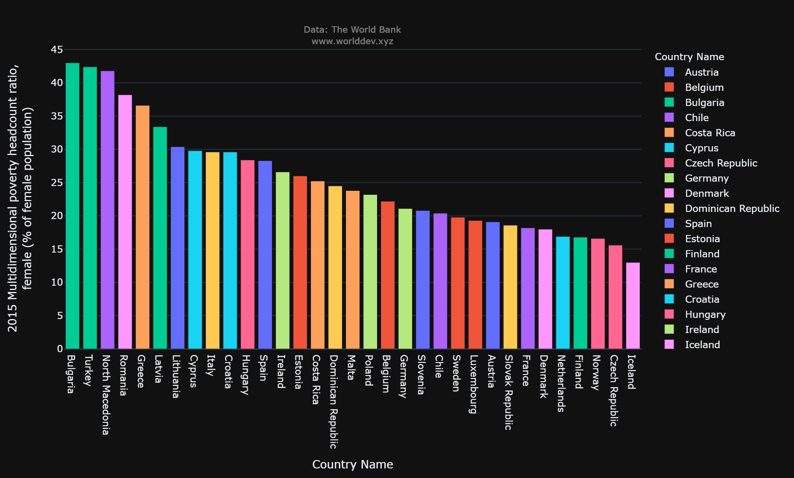
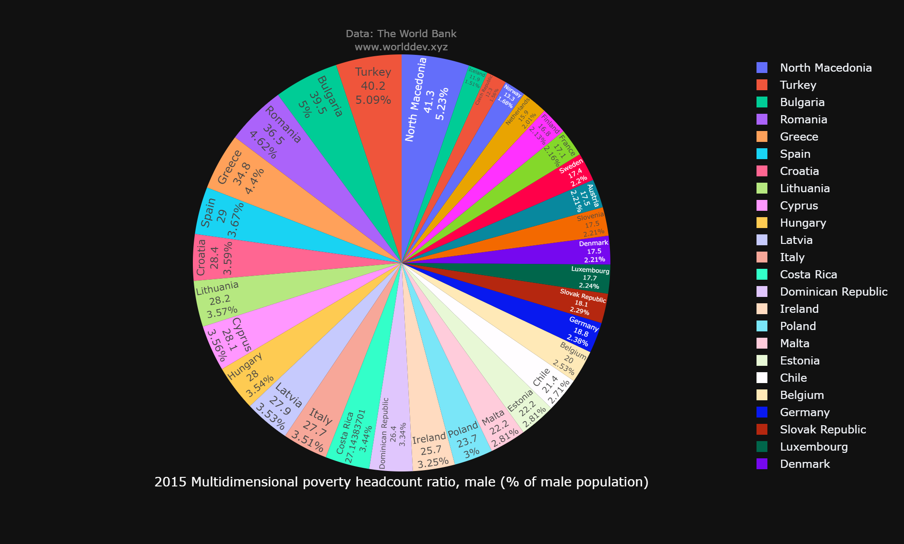
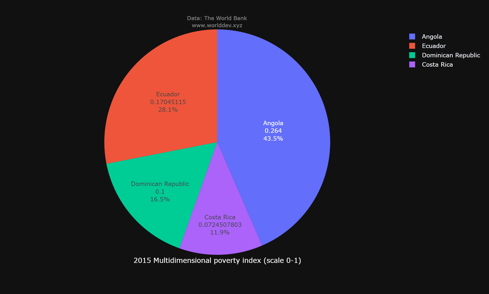

### PART-A Individual Project

### Name: Badinehal Shivani 
### Professor : Dr. Chaojie Wang

#### The world has made significant progress in eradicating global poverty. Over 1.2 billion people have lifted out of extreme poverty since 1990. In 1990, over 36% of the world's population lived on less than $1.90 per day. Today, 9.2% of the world's population lives on less than $1.90 per day.

## TOPIC 
### POVERTY

## TIME CONSTRAINT
### 2000-2015

### Poverty Headcount($2.50 Per day)
#### Countries Included:
#### Mexico
#### Bolivia
#### Dominican Republic
#### Chile
#### Ecuador
#### Uruguay
#### Gutamala


```python
from IPython.core.display import Image
```


```python
Image('/content/Image1.png')
```


    

    


###### The world has made significant progress in eradicating poverty worldwide. Over 1.2 billion people have been lifted out of poverty since 1990. In 1990, approximately 36% of the world's population lived on less than $1.90 per day.

### Labour Income Poverty Index


```python
Image('/content/Image2.png')
```


    

    


### Country Included:
#### Argentina 
#### The Labor Income Poverty Index (LIPI) is a measure of poverty based on the percentage of households having lower per-capita labor income than the regional poverty levels across time. 
#### Source: LAC Equity Lab: Labor Markets - World Bank's Labor Income Poverty Index (LIPI). https://www.worldbank.org/en/topic/poverty/lac-equity-lab1/labor-markets/lipi
#### Argentina is the sole country that has the Labour Income Poverty Index, as shown in the bar graph above, and the year considered is 2004. Between 2004 and 2014, there was a fall in the value, indicating that Argentina's poverty index value has dropped to nearly half of its original level.


### Multidimensional Poverty Headcount Ratio, Children(% of Population 0-17)


```python
Image('/content/Image3.png')
```


    

    


### Multidimensional headcount ratio :
#### The "incidence" of poverty, or the proportion of people (within a particular population) who face numerous deprivations, is given this formal designation.
#### Poverty incidence (PI)
#### The percentage of families/individuals whose per capita income/expenditure is less than the per capita poverty level compared to the total number of families/individuals.
#### Reference: 1997 Philippine Poverty Statistics
#### Board Resolution: Resolution No. 2 - Series of 2007
#### Approved: 2/14/2007
#### The graph shows that, of all the countries stated above, Angola covers the highest percentage of the headcount ratio (6.55%), while Norway covers the lowest fraction (0.35%). (1.6 percent ). The data shown is from the year 2015.

### Multidimensional Poverty Headcount Ratio, Female(% of Female Population)


```python
Image('/content/Image4.png')
```


    

    


### Multidimensional Poverty Headcount Ratio, Male(% of Male Population)


```python
Image('/content/Image5.png')
```


    

    


### Multidimensional Poverty Index


```python
Image('/content/Image6.png')
```


    

    


### Countries Included:
#### Ecuador
#### Dominican Republic
#### Costa Rica
#### Angola

#### The Data with the scale 0-1 included four countries where Angola covers maximum Percentage(43.5%) of the whole.

### SUMMARY
#### From the facts shown above, it can be inferred that poverty has always existed in at least 2% of the population, whether in a multidimensional or individual setting. According to Global Finance Magazine, the world's poorest countries include the Central African Republic, Congo, Democratic Republic of the Congo, Malawi, Liberia, Burundi, Niger, Ecuador, and Eritrea. Furthermore, when the individual multidimensional poverty index was taken into account, the female percentage was around 88 percent, with the percentage gradually decreasing by 2014.
